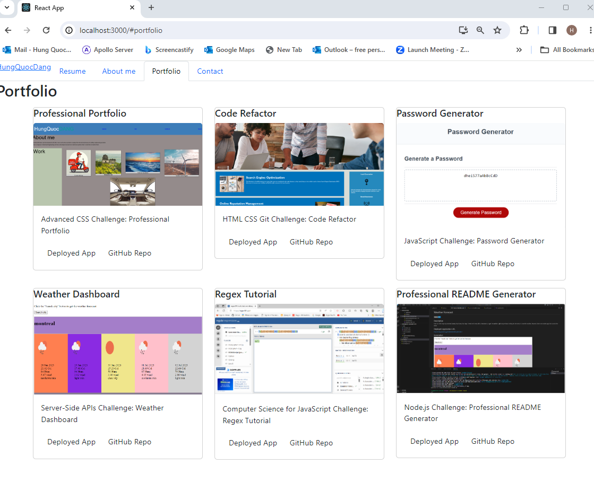

# REACT Portfolio by Hung Quoc Dang

## Summary

This REACT codes,  will show my Portfolio. To clone it from GitHub then do:

npm i 

npm start

Then a browser will open for users to interact with the page.

GitHub link:  https://github.com/HungQuocDang/24_React_Portfolio

Deployed link:  https://hungquocdang.github.io/24_React_Portfolio/

Demo:  https://drive.google.com/file/d/1oRYVEnBYCPv6L-v_7Vrv9yo6a5d6WXxC/view

Heroku: https://reactpotfolio-0c514c582884.herokuapp.com/

